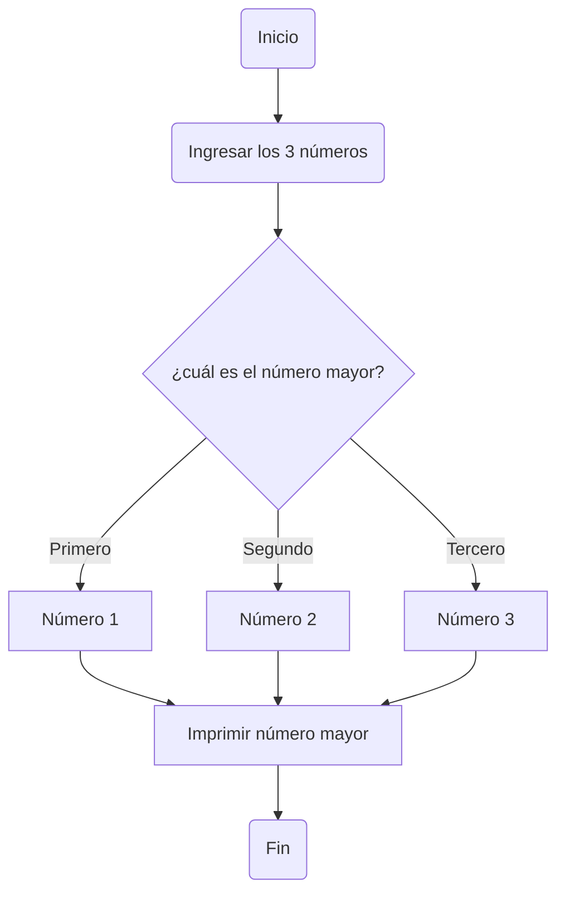

# Taller 1:

Integrantes del equipo:
- Andrés Camilo Bustamante Guzmán
- Jhonatan Esteban Forero Velásquez
- Jaime Eduardo Ríos Villegas
 
 
Enlace de notebook con los ejercicios impares: https://colab.research.google.com/drive/1ExkBTBBtDGU3todwiFg5vGtvhk_F37CV?usp=sharing

## 1. Realice el quiz Python Beginner Quiz (20 preguntas) y adjunte pantallazo con el resultado (mínimo 90% bien).


## 2. Realice un programa que lea tres números reales y determine cuál es el mayor.
   
   El procedimiento para la realización del código es:
   - Definir los 3 números como números reales.
   - Pedir y leer al usuario los 3 números reales.
   - Determinar con el condicional, si el primer número es el mayor. E Imprimir.
   - Determinar con el condicional, si el segundo número es el mayor. E Imprimir.
   - Determinar con el condicional, si el tercer número es el mayor. E Imprimir.
     



```python

numero1 : float 
numero2 : float
numero3 : float

numero1 = float(input("Ingrese el primer número real : "))
numero2 = float(input("Ingrese el segundo número real: "))
numero3 = float(input("Ingrese el tercer número real : "))

if (numero1>=numero2) and (numero1>=numero3):
   print( " El primer número es el mayor de todos: ", (numero1))
elif (numero2>=numero1) and (numero2>=numero3):
   print( " El segundo número es el mayor de todos: ", (numero2))
elif (numero3>=numero1) and (numero3>=numero2):
   print( " El tercer número es el mayor de todos: ", (numero3))


```


## 3. Realice un programa que lea un número enteros y determine si es par o impar.

   El procedimiento para la realización del código es:
   - Definir el número como número entero.
   - Pedir y leer del usuario el número entero.
   - Determinar con el condicional, hallando si el residuo es igual a cero es par. E imprimir que es par.
   - En caso contrario será impar. Imprimir que es impar


```python

numero : int 

numero = int(input("Ingrese un número entero : "))

if (numero % 2) == 0:
   print( "El número es par.")
else:
   print( "El número es impar.")

```


## 4. Realice un programa que lea dos números reales y determine si el primero es múltiplo del segundo.
   
   El procedimiento que se siguió fue:
   - Definir los 2 números como números reales.
   - Pedir y leer del usuario los 2 números reales.
   - Determinar con el condicional, si el primer es múltiplo del segundo, viendo si su residuo es cero.
   - En caso contrario, no será el primer número múltiplo del segundo.
   - Imprimir si es o no múltiplo el primer número del segundo.

```python

numero1 : float 
numero2 : float 

numero1 = float(input("Ingrese el primer número real: "))
numero2 = float(input("Ingrese el segundo número real: "))

if (numero2 % numero1) == 0:
   print( "El primer número sí es múltiplo del segundo número.")
else:
   print( "El primer número no es múltiplo del segundo número.")

```


## 5. Realice un programa que lea tres números reales y determine si la suma de los dos primeros es mayor, menor o igual que el tercer número.
   
   Se realiza el siguiente proceso para obtener el código:
   - Definir los 3 números como números reales.
   - Pedir y leer del usuario los 3 números reales.
   - Determinar con el condicional, si la suma de los dos primeros es igual al tercero. E imprimir.
   - Determinar con el condicional, si la suma de los dos primeros es mayor al tercero. E imprimir.
   - Determinar con el condicional, si la suma de los dos primeros es menor al tercero. E imprimir.

```python

numero1 : float 
numero2 : float
numero3 : float

numero1 = float(input("Ingrese el primer número real : "))
numero2 = float(input("Ingrese el segundo número real: "))
numero3 = float(input("Ingrese el tercer número real : "))

if (numero1+numero2) == numero3:
   print( " La suma de los dos primeros números es igual al tercer número.")
   print((numero1), " + ", (numero2), " = ", (numero3))
elif (numero1+numero2) > numero3:
   print( " La suma de los dos primeros números es mayor al tercer número.")
   print((numero1), " + ", (numero2), " > ", (numero3))
elif (numero1+numero2) < numero3:
   print( " La suma de los dos primeros números es menor al tercer número.")
   print((numero1), " + ", (numero2), " < ", (numero3))

```


## 6. Escriba un programa que solicite al usuario una letra y determine si es una vocal o una consonante.

   Para la elaboración del ejercicio fue necesario ver los valores ASCII para las vocales y consonantes.
   
   
   El procedimiento que se siguió fue el siguiente:
   - Definir la letra que ingrese el usuario como string, y su correspondiente identificador ASCII como número entero.
   - Pedir y leer del usuario la letra.
   - Convertir el ASCII correspondiente de la letra y guardarlo en b.
   - Realizamos dos condicionales anidados:
      - En el primero determinamos si la letra ingresada es una letra, ya sea minúscula o mayúscula.
         - Código ASCII de Minúsculas entre 65 y 90.
         - Código ASCII de mayúsculas entre 97 y 122.
      - En el condicional interno anidado, verificamos si es una vocal, códigos ASCII
         - Código ASCII de vocales Minúsculas entre 65, 69, 73, 79 y 85.
         - Código ASCII de vocales mayúsculas entre 97, 101, 105, 111 y 117.
   -Imprimir según sea el caso, si es vocal, si es consonante, o ninguna de las anteriores.  

```python

a : str
b : int

a = input("Ingrese un caracter: ")
b = ord(a)

if (b >= 65 and b <= 90) or (b >= 97 and b <= 122):
   if (b==65 or b==69 or b==73 or b==79 or b==85 or b==97 or b==101 or b==105 or b==111 or b==117):
      print("El caracter ", (a), " es una vocal.")
   else:
      print("El caracter ", (a), " es una consonante.")
else: 
   print("El caracter ", (a), " no es una vocal, ni una consonante.")

```


## 7. Escriba un programa que pida 5 números reales y calcule las siguientes operaciones:

   - El promedio.
   - La mediana.
   - El promedio multiplicativo (multilplica todos y luego calcula la raíz de la cantidad de operandos).
   - Ordenar los números de forma ascendente.
   - Ordenar los números de forma descendente.
   - La potencia del mayor número elevado al menor número.
   - La raíz cúbica del menor número.

   El procedimiento para la realización del código es:
   - Definir los 5 números como números reales.
   - Pedir y leer del usuario los 5 números reales.
   - Calcular el promedio aritmético de los 5 números. E imprimir.
   - Calcular el promedio multiplicativo de los 5 números. E imprimir.
    


   
```python

n1 : float 
n2 : float
n3 : float
n4 : float
n5 : float

n1 = float(input("Ingrese el primer número real : "))
n2 = float(input("Ingrese el segundo número real: "))
n3 = float(input("Ingrese el tercer número real : "))
n4 = float(input("Ingrese el cuarto número real : "))
n5 = float(input("Ingrese el quinto número real : "))

promedio : float = (n1+n2+n3+n4+n5) / 5
mediana : float
promedioMultiplicativo : float = (n1*n2*n3*n4*n5) ** (1/5)


print( " El promedio aritmético de los cinco números es: ", (promedio))
print( " El promedio multiplicativo de los cinco números es: ", (promedioMultiplicativo))

# falta terminarlo

```


## 8. Escriba un programa al que se le ingrese la frecuencia de una onda en hz y como salida arroje en que parte del espectro electromagnético se encuentra.
   
   Con ayuda de Wikipedia vemos los valores de frecuencia del espectro electromágnético.


   El procedimiento para la realización del código es:
   - Definir la frecuencia como número real.
   - Pedir y leer del usuario la frecuencia en Hertz.
   - Determinar con condicionales, a qué grupo pertenece del espectro electromagnético la frecuencia.
   - Imprimir a qué grupo del espectro electromagnético pertenece la frecuencia.


```python
   frecuencia : float 
   
   frecuencia = float(input("Ingrese la frecuencia de una onda en hertz [Hz]: \n Tip: Para ingresar en notación científica, escribir e (base 10): ejemplo 15.6e14 :  "))
   
   if (30.0e18<frecuencia):
      print("La onda se ubica en Rayos Gamma.")
   elif (30.0e15<=frecuencia) and (frecuencia<30.0e18):
      print("La onda se ubica en Rayos X.")
   elif (1.5e15<=frecuencia) and (frecuencia<30.0e15):
      print("La onda se ubica en Ultravioleta extremo.")
   elif (7.89e14<=frecuencia) and (frecuencia<1.5e15):
      print("La onda se ubica en Ultravioleta cercano.")
   elif (384e12<=frecuencia) and (frecuencia<7.89e14):
      print("La onda se ubica en Espectro Visible.")
   elif (120e12<=frecuencia) and (frecuencia<384e12):
      print("La onda se ubica en Infrarrojo cercano.")
   elif (6.00e12<=frecuencia) and (frecuencia<120e12):
      print("La onda se ubica en Infrarrojo medio.")
   elif (300e9<=frecuencia) and (frecuencia<6.00e12):
      print("La onda se ubica en Infrarrojo lejano / submilimétrico.")
   elif (3e8<=frecuencia) and (frecuencia<300e9):
      print("La onda se ubica en Microondas.")
   elif (300e6<=frecuencia) and (frecuencia<3e8):
      print("La onda se ubica en Ultra Alta Frecuencia - Radio.")
   elif (30e6<=frecuencia) and (frecuencia<300e6):
      print("La onda se ubica en Muy Alta Frecuencia - Radio.")
   elif (1.7e6<=frecuencia) and (frecuencia<30e6):
      print("La onda se ubica en Onda Corta - Radio.")
   elif (650e3<=frecuencia) and (frecuencia<1.7e6):
      print("La onda se ubica en Onda Media - Radio.")
   elif (30e3<=frecuencia) and (frecuencia<650e3):
      print("La onda se ubica en Onda Larga - Radio.")
   elif (frecuencia<30e3):
      print("La onda se ubica en Muy Baja Frecuencia - Radio.")
   elif (frecuencia<0):
      print("Error: El valor de frecuencia ingresada es un número negativo.")
   
```


## 9. Escriba un programa que reciba el nombre en minúsculas de un país de America y retorne la ciudad capital, si el país no pertenece al continente debe arrojar país no identificado.
    
   El procedimiento para la realización del código es:
   - Definir un diccionario con los países y sus capitales en América.
   - Definir una función para obtener la capital de un país.
      - Convertir el nombre del país a minúsculas.
      - Verificar si el país está en el diccionario.
   - Pedir y leer del usuario el nombre de un país de América.
   - Hacer llamado de la función para obtener la capital del un país.
   - Imprimir el país y su capital.
   
```python
# Definir un diccionario con los países y sus capitales en América
paises_y_capitales = {
    "argentina": "Buenos Aires",
    "brasil": "Brasilia",
    "canada": "Ottawa",
    "chile": "Santiago",
    "colombia": "Bogota",
    "estados unidos": "Washington d.c.",
    "mexico": "Ciudad de Mexico",
    "peru": "Lima",
    "belice": "Belmopan",
    "guatemala": "Ciudad de Guatemala",
    "el salvador": "San Salvador",
    "honduras": "Tegucigalpa",
    "nicaragua": "Managua",
    "costa rica": "San Jose",
    "panama": "Ciudad de Panamá",
    "cuba": "La Habana",
    "jamaica": "Kingston",
    "haiti": "Puerto Principe",
    "republica dominicana": "Santo Domingo",
    "bahamas": "Nassau",
    "puerto rico": "San Juan",
    "antigua y barbuda": "Saint John",
    "dominica": "Roseau",
    "san cristobal y nieves": "Basseterre",
    "santa lucia": "Castries",
    "san vicente y las granadinas": "Kingstown",
    "trinidad y tobago": "Puerto España",
    "granada": "Saint George",
    "barbados": "Bridgetown",
    "venezuela": "Caracas",
    "guyana": "Georgetown",
    "surinam": "Paramaribo",
    "bolivia": "Sucre",
    "ecuador": "Quito",
    "paraguay": "Asuncion",
    "uruguay": "Montevideo"
}         

# Función para obtener la capital de un país en minúsculas
def obtener_capital(pais):
    # Convertir el país a minúsculas
    pais = pais.lower()
    
    # Verificar si el país está en el diccionario
    if pais in paises_y_capitales:
        return paises_y_capitales[pais]
    else:
        return "País no identificado."

# Pedir al usuario que ingrese un país y mostrar la capital
pais_ingresado = input("Ingresa el nombre de un país de América: ")
capital = obtener_capital(pais_ingresado)
print(f"La capital de {pais_ingresado.capitalize()} es {capital.capitalize()}.")
```


## 10. Escriba un programa que dada una distancia calcule:

   - El tiempo que le tomaría a la luz recorrer la distancia.
   - El tiempo que le tomaría al sonido (en el aire) recorrer la distancia.
   - El tiempo que le tomaría al vehiculo comercial más veloz recorrer la distancia.
   - El tiempo que le tomaría a Bolt recorrer la distancia.

   Para realizar el código fue necesario:
   - Definir la variable distancia como un número real.
   - Pedir y leer del usuario el valor de una distancia en metros.
   - Definir como constantes las velocidades consultadas.
   - Imprimir y calcular el valor de cada uno de los tiempos requeridos para diferentes velocidades.
      - Recordar que: velocidad = distancia / tiempo
      - Y despejando: tiempo = distancia / velocidad 

```python

distancia : float 

distancia = float(input("Ingrese el valor de una distancia [en metros] : "))

velocidadLuz : float = 299792.458      # Velocidad de la Luz [m/s]
velocidadSonido : float = 343.2       # Velocidad del sonido (en el aire) [m/s]
velocidadComercial : float = 141.263889  # Velocidad del vehículo comercial más veloz [m/s].
                                         # SSC Tuatara, velocidad máxima reconocida oficialmente de 508,55 km/h
velocidadBolt : float = 10.4384133612 # Velocidad alcanzada por Usain Bolt en los 100 m en 9,58 s [m/s]

print( "El tiempo que le tomaría a la luz recorrer la distancia: ", distancia/velocidadLuz, " s")
print( "El tiempo que le tomaría al sonido en el aire recorrer la distancia: ", distancia/velocidadSonido, " s")
print( "El tiempo que le tomaría al vehículo comercial más veloz en recorrer la distancia: ", distancia/velocidadComercial, " s")
print( "El tiempo que le tomaría a Usain Bolt recorrer la distancia: ", distancia/velocidadBolt, " s")

```


